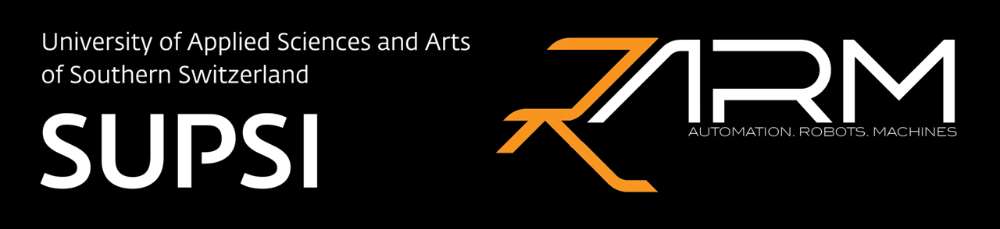

# Automation, Robotics and Machines Lab (ARM Lab) – SUPSI

The **Automation, Robotics and Machines (ARM) Lab** at the  
**University of Applied Sciences and Arts of Southern Switzerland (SUPSI)**  
focuses on advanced research, innovation and technology transfer in industrial and service robotics, mechatronics, and automation.

Our mission is to design intelligent machines and robotic systems that support people and improve industrial processes — enhancing efficiency, precision, and safety across multiple application domains.

🔗 Learn more on our website: https://www.isteps.supsi.ch/en/automation-robotics-and-machines

## What We Do

- **Industrial & Service Robotics**  
  Development of robotic solutions for manufacturing, logistics, healthcare, and collaborative environments.

- **Mechatronics & Machine Design**  
  Integration of mechanical systems, electronics, and smart control for high-performance machines.

- **Automation & Control Systems**  
  Advanced motion control, monitoring, and digitalization for Industry 4.0 environments.

- **Human–Machine Interaction & Safety**  
  Robots and automation designed to safely cooperate with humans.

- **Research & Technology Transfer**  
  Collaboration with companies, academia, and institutions to bring cutting-edge innovation into the real world.
